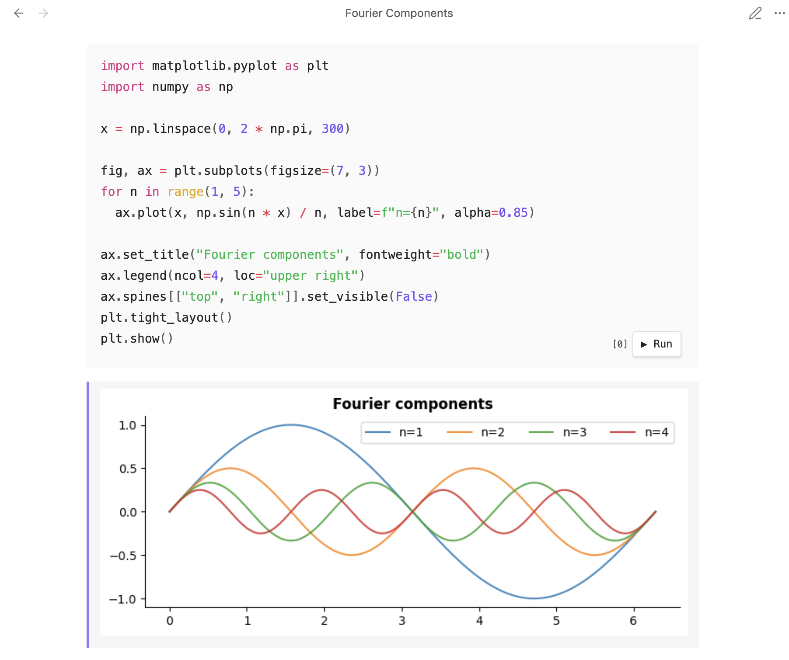

# Obsidian Markdown Notebook

An experimental Obsidian plugin that brings a Jupyter-style notebook experience to plain Markdown files. Code cells execute directly in your notes, and their outputs — text, tables, plots — are stored in the file itself.



## How It Works

All code blocks for supported languages are executable. Just write your code and click **▶ Run**:

````markdown
```python
import pandas as pd

df = pd.DataFrame({"name": ["Alice", "Bob"], "score": [92, 85]})
df
```
````

Outputs are stored directly in the Markdown file as a comment block immediately below the cell — either as HTML:

```html
<!-- nb-output hash="a3f1b2c4d5e6f7a8" format="html" -->
<div class="nb-output">
  <table>...</table>
</div>
<!-- /nb-output -->
```

Or as a saved image link:

```html
<!-- nb-output hash="a3f1b2c4d5e6f7a8" format="image" -->
![[my-note-nb-a3f1b2c4.png]]
<!-- /nb-output -->
```

Comment markers are invisible in all standard Markdown renderers — including PDF export, GitHub, and Obsidian's reading view.

## Features

- **Native Markdown** — outputs are stored in the `.md` file, no sidecar files required
- **Persistent outputs** — outputs survive Obsidian restarts and render in reading view
- **Rich output rendering** — HTML tables, matplotlib plots, plain text, and saved images
- **Execution count** — `[N]` badge on each run button, Jupyter-style, resets on kernel restart
- **Run All** — execute every cell in the note in order with a single command
- **Shared kernel state** — variables defined in one cell are available in subsequent cells
- **Export-friendly** — outputs render correctly in Pelican, PDF, and any HTML-aware renderer

## Requirements

- Obsidian 1.7.2 or later (desktop only)
- One or more of:
  - Python 3.8+ (`python3` on PATH)
  - Node.js 14+ (`node` on PATH)
  - Bash (`bash` on PATH)
  - R 4.0+ (`Rscript` on PATH)

Optional but recommended for Python:

- `pandas` — for DataFrame rendering
- `matplotlib` — for inline plots

## Usage

### Supported languages

| Fence language | Aliases | Runtime |
|---|---|---|
| `python` | — | Persistent Python 3 subprocess |
| `javascript` | `js` | Persistent Node.js subprocess |
| `bash` | `sh`, `shell` | Fresh `bash -c` per cell |
| `r` | — | Persistent R subprocess |

### Running cells

Click **▶ Run** on any supported language block in reading view. The `[N]` badge to the left of the button shows how many cells have executed since the kernel started.

### Output formats

Two formats are supported, controlled with the `format` argument:

| Argument | Stored as | Best for |
|---|---|---|
| `format=html` | HTML in comment block | DataFrames, rich objects, text (default) |
| `format=image` | PNG saved to vault, `![[...]]` link | Plots, any output you want as an image |

Example:

````markdown
```python {format=image}
import matplotlib.pyplot as plt
plt.plot([1, 2, 3])
plt.show()
```
````

If `format=image` is set but the code produces no native image (e.g. a DataFrame instead of a plot), the output is rendered to PNG automatically using the browser's layout engine.

The default format is `html` and can be changed in plugin settings or per-note via frontmatter.

### Cell IDs

Assign a stable identifier to a cell with `id=`:

````markdown
```python {format=image id=revenue-chart}
...
plt.show()
```
````

The ID is used as the image filename (`revenue-chart.png`). Without an ID, images are named `notename-nb-<hash>.png`. IDs make filenames stable across re-runs and easier to reference from other notes.

### Document-level defaults (frontmatter)

Set defaults for all cells in a note via the `notebook:` key in frontmatter:

```yaml
---
notebook:
  format: image       # default output format (html | image)
  media: attachments  # image save folder, relative to vault root
  timeout: 60000      # execution timeout in ms
  markdownLinks: true # use  instead of ![[file]] for images
---
```

Cell-level args override frontmatter, which overrides plugin settings:

> plugin settings → frontmatter → cell args

### Commands

| Command | Description |
|---|---|
| Markdown Notebook: Run all cells | Execute every supported code block in the active note, top to bottom |
| Markdown Notebook: Restart all kernels | Kill and restart every language kernel, clearing all variables |
| Markdown Notebook: Interrupt kernel | Send SIGINT to a running cell |

### Settings

| Setting | Default | Description |
|---|---|---|
| Execution timeout | `30000` | Maximum execution time per cell (ms) |
| Python path | `python3` | Path to the Python executable |
| Node.js path | `node` | Path to the Node.js executable |
| Shell path | `bash` | Path to the shell interpreter |
| R path | `R` | Path to the R executable |
| Default output format | `html` | Format used when no `format=` arg is set (`html` or `image`) |
| Media folder | *(empty)* | Vault-relative folder for saved images. Empty = save next to the note. |
| Markdown image links | off | Use `` instead of `![[file]]` for saved images |

## Output Block Format

Outputs are stored between HTML comment markers:

```
<!-- nb-output hash="<hex>" format="<format>" -->
<content>
<!-- /nb-output -->
```

| Attribute | Description |
|---|---|
| `hash` | SHA-256 digest (8 bytes) of the cell's language + source |
| `format` | `html` or `image`. Absent means `html`. |
| `id` | Cell identifier, if set. Used in image filenames. |

Example markers:

```html
<!-- nb-output hash="a3f1b2c4" format="html" -->
<!-- nb-output id="revenue-chart" hash="a3f1b2c4" format="image" -->
```

This format is intentionally simple and human-readable. GitHub rendering is not a goal.

## Security Note

Output blocks contain raw HTML generated by your code. This is intentional — it is what enables rich rendering of tables and plots. The trust model is the same as Jupyter notebooks: outputs are as trustworthy as the code that produced them. Do not open notebooks from untrusted sources.

## Installation

### Via BRAT (recommended for early access)

[BRAT](https://github.com/TfTHacker/obsidian42-brat) lets you install plugins that aren't yet in the Obsidian community directory.

1. Install **Obsidian42 - BRAT** from the Obsidian community plugins directory
2. Open BRAT settings and click **Add Beta Plugin**
3. Enter the repository URL: `https://github.com/lextoumbourou/obsidian-markdown-notebook`
4. Click **Add Plugin**, then enable **Markdown Notebook** in Settings → Community Plugins

BRAT will also notify you when new versions are available.

### Manual

1. Download `main.js`, `manifest.json`, and `styles.css` from the [latest release](https://github.com/lextoumbourou/obsidian-markdown-notebook/releases)
2. Copy them into `.obsidian/plugins/obsidian-markdown-notebook/` in your vault
3. Enable **Markdown Notebook** in Settings → Community Plugins

## Development

```bash
npm install
```

| Command | Description |
|---|---|
| `npm run dev` | Build in watch mode |
| `npm run build` | Type-check and build for production |
| `npm test` | Run the test suite |
| `npm run test:watch` | Run tests in watch mode |
| `npm run lint` | Lint `src/` with ESLint |
| `npm run lint:fix` | Auto-fix lint errors |

Tests live in `__tests__/` and use Jest + ts-jest. The Obsidian API is mocked in `__mocks__/obsidian.ts` so the suite runs without an Obsidian install.

## Similar Projects

**[Obsidian Code Emitter](https://github.com/mokeyish/obsidian-code-emitter)**
The most similar plugin. Supports 15+ languages with a Play button on any code fence, including Python via WebAssembly (Pyodide) and external playgrounds for compiled languages. Key difference: outputs are stored only in browser localStorage — they are not written to the `.md` file, do not survive a vault reload, and cannot be exported or rendered outside Obsidian.

**[Obsidian Jupyter](https://github.com/alexis-/obsidian-jupyter)**
Opens `.ipynb` files in Obsidian by spawning a local Jupyter server and embedding its web UI in a webview. Outputs are persisted, but in the `.ipynb` JSON format — not plain Markdown. Requires the full Jupyter stack.

**[JupyMD for Obsidian](https://github.com/d-eniz/jupymd)**
Uses [Jupytext](https://github.com/mwouts/jupytext) to pair Markdown files with `.ipynb` notebooks. Requires the full Jupyter stack; outputs live in the companion `.ipynb`, not inline in Markdown.

**[Obsidian Execute Code Plugin](https://github.com/twibiral/obsidian-execute-code)**
Supports many languages and has a polished UI. Outputs are stored as plain text in fenced `output` blocks rather than as rendered HTML; no staleness detection.

**[Jupyter Notebook](https://github.com/jupyter/notebook)**
The primary inspiration. This project aims to bring Jupyter's output rendering quality into Obsidian without requiring the Jupyter server.

**[JEP #103 — Markdown-based Notebooks](https://github.com/jupyter/enhancement-proposals/pull/103)**
A 2023 Jupyter Enhancement Proposal for a standard Markdown notebook format. The proposal stalled without consensus. This project takes a pragmatic, Obsidian-native approach rather than waiting for a standard.
