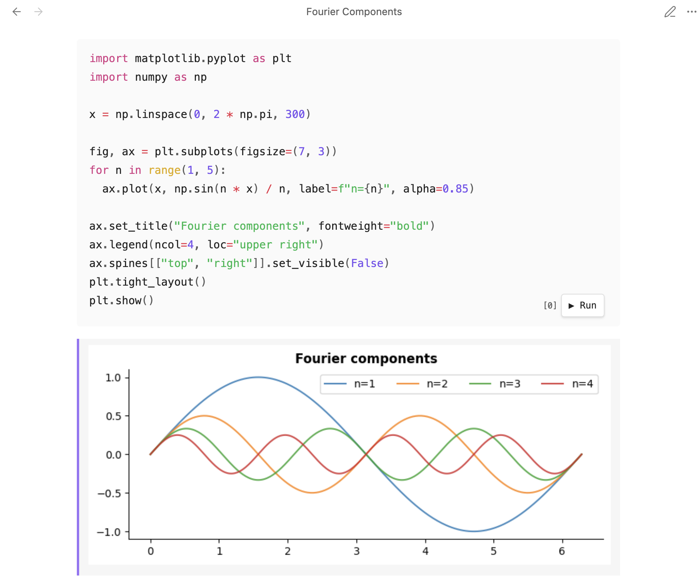

# Obsidian Markdown Notebook

An experimental Obsidian plugin that brings a Jupyter-style notebook experience to plain Markdown files. Code cells execute directly in your notes, and their outputs — text, tables, plots — are stored in the file itself.



## How It Works

All code blocks for supported languages are executable. Just write your code and click **▶ Run**:

````markdown
```python
import pandas as pd

df = pd.DataFrame({"name": ["Alice", "Bob"], "score": [92, 85]})
df
```
````

Outputs are stored directly in the Markdown file as a comment block immediately below the cell — either as HTML:

```html
<!-- nb-output hash="a3f1b2c4d5e6f7a8" format="html" -->
<div class="nb-output">
  <table>...</table>
</div>
<!-- /nb-output -->
```

Or as a saved image link:

```html
<!-- nb-output hash="a3f1b2c4d5e6f7a8" format="image" -->
![[a3f1b2c4d5e6f7a8.png]]
<!-- /nb-output -->
```

Comment markers are invisible in all standard Markdown renderers — including PDF export, GitHub, and Obsidian's reading view.

## Features

- **Native Markdown** — outputs are stored in the `.md` file, no sidecar files required
- **Persistent outputs** — outputs survive Obsidian restarts and render in reading view
- **Rich output rendering** — HTML tables, matplotlib plots, plain text, and saved images
- **Execution count** — `[N]` badge on each run button, Jupyter-style, resets on kernel restart
- **Run All** — execute every cell in the note in order with a single command
- **Managed background cells** — start and stop long-running servers from Python, JavaScript, Bash, or R cells without blocking later cells
- **Clear outputs** — remove one cell's persisted output or every output block in the active note
- **Notebook-scoped kernel state** — variables are shared between cells in one note but isolated from other notes
- **DuckDB SQL cells**: query CSV, JSON, and Parquet files directly, with temporary tables and macros shared across cells
- **Predictable relative paths** — every kernel starts in the note's folder, so `data.csv` and other relative paths work naturally
- **Persistent failure diagnostics**: Python, Node.js, R, and DuckDB errors plus non-zero shell exits are marked as failed, with escaped diagnostics and preceding output stored in the note
- **Output size protection** — persisted output is capped at 100 KB per cell by default, with a visible truncation marker instead of an oversized note
- **Robust failure handling** — distinct ⏱ timeout state, runaway cells are interrupted on timeout, and output blocks left mid-run by a crash are repaired on next open
- **Headless runner** — the `nb-run` CLI executes cells and updates outputs without Obsidian (publish pipelines, CI)
- **Export-friendly** — outputs render correctly in Pelican, PDF, and any HTML-aware renderer

## Requirements

- Obsidian 1.7.2 or later (desktop only)
- One or more of:
  - Python 3.8+ (`python3` on PATH)
  - Node.js 14+ (`node` on PATH)
  - Bash (`bash` on PATH)
  - R 4.0+ (`R` on PATH)
  - DuckDB CLI (`duckdb` on PATH)

Optional but recommended for rich output:

- Python: `pandas` (DataFrame tables), `matplotlib` (inline plots)
- R: `knitr` + `jsonlite` (data frame tables), `base64enc` (plot capture) — plain-text output works without them

## Usage

### Supported languages

| Fence language | Aliases | Runtime |
|---|---|---|
| `python` | — | Persistent Python 3 subprocess |
| `javascript` | `js` | Persistent Node.js subprocess |
| `bash` | `sh`, `shell` | Fresh `bash -c` per cell |
| `r` | — | Persistent R subprocess |
| `sql` | `duckdb` | Persistent in-memory DuckDB CLI session |

### DuckDB SQL

Install the DuckDB CLI (`brew install duckdb` on macOS), then use `sql` or
`duckdb` fences. Each note gets its own in-memory DuckDB session, so temporary
tables, attached databases and macros remain available to later cells:

````markdown
```sql
CREATE TEMP TABLE totals AS SELECT 42 AS answer;
```

```sql
SELECT * FROM totals;
```
````

Query results render as HTML tables. Relative CSV, JSON, Parquet and database
paths resolve from the note's working directory. Use one final query per cell
for the clearest table output. SQL errors fail the cell without discarding the
session. Configure the executable globally with **DuckDB path**, per note with
`notebook.duckdb`, or in `nb-run` with `--duckdb`.

### Running cells

Click **▶ Run** on any supported language block in reading view. The `[N]` badge to the left of the button shows how many cells have executed since the kernel started.

For notebook-wide execution, click **▶ Run all cells** at the top of the reading view. The toolbar reports the cell count and live progress while cells run in document order. While execution is active, the same button becomes **■ Stop** and interrupts the current cell without starting the remaining cells. Individual cell buttons behave the same way. Run all stops after the first error or timeout by default; disable **Stop on first error** in plugin settings to continue through independent cells. The same run action remains available from the command palette as **Markdown Notebook: Run all cells**.

In Live Preview or Source mode, place the cursor inside a supported code cell (or its persisted output) and run **Markdown Notebook: Run cell under cursor** from the command palette. Assign any hotkey to this command in Obsidian's **Hotkeys** settings for a fast edit-run loop without switching views. Press the command again while that cell is running to stop it.

The editor commands **Run all cells above cursor** and **Run cell and all cells below cursor** rebuild only the required portion of shared kernel state. “Above” excludes the cursor cell; “below” includes it. Both use the same progress, error-handling, and persisted-output behavior as Run All.

### Background processes

Add `background=<name>` to run a long-lived process without blocking the notebook:

````markdown
```python {background=server ready=port:8000}
from http.server import HTTPServer, SimpleHTTPRequestHandler

HTTPServer(("127.0.0.1", 8000), SimpleHTTPRequestHandler).serve_forever()
```
````

The cell runs in a fresh process. Its **Run** button becomes **Stop**, and Run
All continues when the process accepts connections on IPv4 loopback
(`127.0.0.1`) port 8000. The same syntax works with `javascript`, `bash`, and
`r` fences. The process uses that language's configured executable and the
note's configured working directory.

Use `ready=port:<number>` for a server. The port must be free before the
process starts. For a process that does not listen on a port, wait for a
literal stdout or stderr message instead. Double quotes allow spaces:

````markdown
```python {background=worker ready="Worker ready"}
run_worker()
```
````

Readiness output is matched literally, not as a regular expression. If a
background cell has no `ready` argument, startup retains its 400 ms crash
check and then continues as before. A readiness wait defaults to 15 seconds.
Set `notebook.readyTimeout` in milliseconds to override it for the note.

By default, a background cell tangles and replays preceding, non-background
cells of the same language. This gives its fresh process the imports and
definitions available above it in the document:

````markdown
```python
app = create_app()
```

```python {background=server}
app.run()
```
````

Use `{background=server context=none}` when the background cell is
self-contained. Context does not cross language boundaries, so a Bash cell
cannot set state for a Python background cell. Run All executes setup cells in
the notebook kernel and replays them in the background process. Restarting the
process retangles the current Markdown source, including edits to setup cells.

For `nb-run --only`, only the selected cell emits output, but a selected
background cell still receives its preceding source context.

Background names are scoped to a note. The plugin stops its processes when you press **Stop**, close or rename the note, restart its kernels, or unload the plugin. If a process exits by itself, the button returns to **Run**. Startup output is stored in the note, but later output is only drained in memory so a long-running server cannot grow the Markdown file without limit.

Use a unique name for each concurrent process in a note. A second cell cannot start a process while the same name is already running.

Language exceptions and non-zero shell exit codes produce `status="error"` output blocks. The failure marker is stored together with everything emitted before the failure and the escaped traceback or stderr, so diagnostics remain available after reopening the note.

Shell commands such as `grep`, `diff`, and `test` commonly use non-zero exits for expected outcomes. Handle that status in the cell or append `|| true` when it should not fail the cell or stop Run All.

### Output formats

The `format` argument controls how output is stored:

| Argument | Stored as | Best for |
|---|---|---|
| `format=html` | HTML in comment block | DataFrames, rich objects, text (default) |
| `format=image` | PNG saved to vault, `![[...]]` link | Plots, any output you want as an image |
| `format=json` | Syntax-highlighted Markdown code fence | JSON text |

Example:

````markdown
```python {format=image}
import matplotlib.pyplot as plt
plt.plot([1, 2, 3])
plt.show()
```
````

If `format=image` is set but the code produces no native image (e.g. a DataFrame instead of a plot), the output is rendered to PNG automatically using the browser's layout engine.

The default format is `html` and can be changed in plugin settings or per-note via frontmatter.

To store plain text output as a syntax-highlighted Markdown code block, use its
fence language as the format:

````markdown
```python {format=json}
import json
print(json.dumps({"status": "ok"}, indent=2))
```
````

The plugin labels the output with that language. It does not convert the output
or validate that it contains valid JSON.

### Cell IDs

Assign a stable identifier to a cell with `id=`:

````markdown
```python {format=image id=revenue-chart}
...
plt.show()
```
````

The ID is used as the image filename (`revenue-chart.png`). Without an ID, images are named `<hash>.png` after the cell's content hash. IDs make filenames stable across re-runs and easier to reference from other notes — but note that filenames are not namespaced by note, so two notes sharing a media folder should use distinct IDs.

### Document-level defaults (frontmatter)

Set defaults for all cells in a note via the `notebook:` key in frontmatter:

```yaml
---
notebook:
  format: image       # default output format (html | image)
  media: attachments  # image save folder, relative to vault root
  timeout: 60000      # execution timeout in ms
  readyTimeout: 15000 # background readiness timeout in ms
  outputLimit: 250    # maximum persisted output per cell in KB
  markdownLinks: true # use  instead of ![[file]] for images
  cwd: /              # optional: use vault root instead of the note folder
  python: .venv/bin/python # optional per-note Python executable
  duckdb: duckdb       # optional per-note DuckDB CLI executable
---
```

Cell-level args override frontmatter, which overrides plugin settings:

> plugin settings → frontmatter → cell args

`outputLimit` overrides the global maximum output size for that note, in KB. The limit is measured against rendered UTF-8 output, so escaped HTML cannot expand far beyond it; excess output is discarded after a visible truncation marker. Space is reclaimed from ordinary output for a final traceback, which is independently truncated from the beginning if necessary so the exception itself remains visible.

Native PNGs produced by a successful `format=image` cell are saved as attachments and only their small link is stored in the note, so the attachment data is not counted against this Markdown limit. If that cell fails or times out after producing a plot, the failure block retains capped text diagnostics but does not embed the plot.

By default, Python, Node.js, Bash, R and DuckDB execute with the note's folder as their working directory. Set `cwd: /` (or `cwd: vault`) to use the vault root. Any other relative `cwd` is resolved from the note's folder; absolute filesystem paths are also supported.

The `python`, `node`, `shell`, `r`, and `duckdb` frontmatter keys override their corresponding global executable settings for that note. Frontmatter executable paths containing a directory component, such as `.venv/bin/python`, are resolved from the note's folder. Relative paths in the global executable settings are resolved from the vault root, while plain command names such as `python3` continue to use `PATH`.

Each note has its own persistent language kernels. State is shared between cells in that note, while variables, working directories, execution counts, and per-note environments do not leak into other notes. A note's kernels are shut down when its last Markdown tab or split closes, or when the note is renamed or deleted; reopening it starts a fresh session.

### Commands

| Command | Description |
|---|---|
| Markdown Notebook: Run cell under cursor | Execute the cell at the editor cursor, or stop it if already running |
| Markdown Notebook: Run all cells above cursor | Execute every cell before the editor cursor |
| Markdown Notebook: Run cell and all cells below cursor | Execute the cursor cell and every cell after it |
| Markdown Notebook: Run all cells | Execute every supported code block in the active note, top to bottom |
| Markdown Notebook: Clear current cell output | Remove the output for the executable cell under the editor cursor |
| Markdown Notebook: Clear all outputs in active note | Remove every persisted output block from the active note |
| Markdown Notebook: Restart all kernels | Kill every notebook-scoped language kernel, clearing all variables |
| Markdown Notebook: Interrupt kernel | Send SIGINT to kernels belonging to the active note |

Clear commands modify only the note's `nb-output` blocks. Saved PNG attachments are retained because another note may reference them. To avoid a completed run immediately recreating cleared output, clearing is refused while an individual cell or Run All is active in that note.

### Settings

| Setting | Default | Description |
|---|---|---|
| Show Run all toolbar | on | Show notebook-wide execution controls at the top of Reading View |
| Stop on first error | on | Stop Run all after the first failed or timed-out cell |
| Execution timeout | `30000` | Maximum execution time per cell (ms) |
| Maximum output size | `100` | Maximum rendered output stored per cell (KB) |
| Python path | `python3` | Path to the Python executable |
| Node.js path | `node` | Path to the Node.js executable |
| Shell path | `bash` | Path to the shell interpreter |
| R path | `R` | Path to the R executable |
| DuckDB path | `duckdb` | Path to the DuckDB CLI executable |
| Default output format | `html` | Format used when no `format=` arg is set (`html` or `image`) |
| Media folder | *(empty)* | Vault-relative folder for saved images. Empty = save next to the note. |
| Markdown image links | off | Use `` instead of `![[file]]` for saved images |

## Output Block Format

Outputs are stored between HTML comment markers:

```
<!-- nb-output hash="<hex>" format="<format>" -->
<content>
<!-- /nb-output -->
```

| Attribute | Description |
|---|---|
| `hash` | SHA-256 digest (8 bytes) of the cell's language + source |
| `format` | `html`, `image`, or the language of a fenced text output such as `json`. Absent means `html`. |
| `id` | Cell identifier, if set. Used in image filenames. |
| `status` | `running`, `error`, or `timeout` for in-progress/failed cells. Absent for successful output. |

Example markers:

```html
<!-- nb-output hash="a3f1b2c4" format="html" -->
<!-- nb-output id="revenue-chart" hash="a3f1b2c4" format="image" -->
```

This format is intentionally simple and human-readable. GitHub rendering is not a goal.

## Security Note

Output blocks contain raw HTML generated by your code. This is intentional — it is what enables rich rendering of tables and plots. The trust model is the same as Jupyter notebooks: outputs are as trustworthy as the code that produced them. Do not open notebooks from untrusted sources.

## Installation

### Via BRAT (recommended for early access)

[BRAT](https://github.com/TfTHacker/obsidian42-brat) lets you install plugins that aren't yet in the Obsidian community directory.

1. Install **Obsidian42 - BRAT** from the Obsidian community plugins directory
2. Open BRAT settings and click **Add Beta Plugin**
3. Enter the repository URL: `https://github.com/lextoumbourou/obsidian-markdown-notebook`
4. Click **Add Plugin**, then enable **Markdown Notebook** in Settings → Community Plugins

BRAT will also notify you when new versions are available.

### Manual

1. Download `main.js`, `manifest.json`, and `styles.css` from the [latest release](https://github.com/lextoumbourou/obsidian-markdown-notebook/releases)
2. Copy them into `.obsidian/plugins/obsidian-markdown-notebook/` in your vault
3. Enable **Markdown Notebook** in Settings → Community Plugins

## Development

```bash
npm install
```

| Command | Description |
|---|---|
| `npm run dev` | Build in watch mode |
| `npm run build` | Type-check and build for production |
| `npm test` | Run the test suite |
| `npm run test:watch` | Run tests in watch mode |
| `npm run lint` | Lint `src/` with ESLint |
| `npm run lint:fix` | Auto-fix lint errors |

Tests live in `__tests__/` and use Jest + ts-jest. The Obsidian API is mocked in `__mocks__/obsidian.ts` so the suite runs without an Obsidian install.

For manual smoke testing, open `example-vault/` directly as an Obsidian vault — the plugin inside it is symlinked to the repo's build output, and each note covers one language or feature with expected results annotated. Reset after a test run with `git checkout -- example-vault && git clean -fd example-vault`.

### CLI runner

`npm run build` also produces `cli.js` (`nb-run`), a headless cell runner that uses the same kernels and writes the same `nb-output` blocks as the plugin — useful for refreshing notebook outputs at publish time, CI, or editing outside Obsidian.

```text
node cli.js Note.md --list              # list executable cells
node cli.js Note.md --cell 3            # run cells 1..3 (shared kernel state)
node cli.js Note.md --cell 3 --only     # run just cell 3 (fresh kernel)
node cli.js Note.md --id revenue-chart  # run up to the cell with this id
node cli.js Note.md --write             # run all cells, update output blocks in place
node cli.js Note.md --output-limit 250  # cap persisted cell output at 250 KB
node cli.js Note.md --vault-root Vault  # explicit root for notebook.cwd: /
```

Because each invocation starts fresh kernels, targeting a cell runs every cell *up to and including* it by default (Jupyter's "run up to here"), so earlier cells' variables are available; `--only` skips the prelude. Interpreter paths default to `python3`/`node`/`bash`/`R`/`duckdb` and can be overridden with `--python`, `--node`, `--shell`, `--r`, or `--duckdb`. Frontmatter `notebook:` defaults, including `cwd`, `outputLimit`, and per-language executable paths, are respected.

The CLI uses the same `cwd` rules as the plugin. For `cwd: /` or `cwd: vault`, it searches upward from the note for the nearest `.obsidian` directory. If the note is outside a vault copy, pass `--vault-root <dir>`; the CLI fails clearly rather than interpreting `/` as the filesystem root. Relative frontmatter executable paths resolve from the note, while relative command-line executable paths resolve from the shell's current directory. The output limit applies to blocks written with `--write`; live terminal output continues streaming in full.

Two differences from the plugin remain: `format=image` only saves native images (matplotlib/R PNGs) — the browser HTML-to-PNG fallback needs a DOM and degrades to `format=html`; and the media folder is resolved relative to the note's directory.

## Similar Projects

**[Obsidian Code Emitter](https://github.com/mokeyish/obsidian-code-emitter)**
The most similar plugin. Supports 15+ languages with a Play button on any code fence, including Python via WebAssembly (Pyodide) and external playgrounds for compiled languages. Key difference: outputs are stored only in browser localStorage — they are not written to the `.md` file, do not survive a vault reload, and cannot be exported or rendered outside Obsidian.

**[Obsidian Jupyter](https://github.com/alexis-/obsidian-jupyter)**
Opens `.ipynb` files in Obsidian by spawning a local Jupyter server and embedding its web UI in a webview. Outputs are persisted, but in the `.ipynb` JSON format — not plain Markdown. Requires the full Jupyter stack.

**[JupyMD for Obsidian](https://github.com/d-eniz/jupymd)**
Uses [Jupytext](https://github.com/mwouts/jupytext) to pair Markdown files with `.ipynb` notebooks. Requires the full Jupyter stack; outputs live in the companion `.ipynb`, not inline in Markdown.

**[Obsidian Execute Code Plugin](https://github.com/twibiral/obsidian-execute-code)**
Supports many languages and has a polished UI. Outputs are stored as plain text in fenced `output` blocks rather than as rendered HTML; no staleness detection.

**[Jupyter Notebook](https://github.com/jupyter/notebook)**
The primary inspiration. This project aims to bring Jupyter's output rendering quality into Obsidian without requiring the Jupyter server.

**[JEP #103 — Markdown-based Notebooks](https://github.com/jupyter/enhancement-proposals/pull/103)**
A 2023 Jupyter Enhancement Proposal for a standard Markdown notebook format. The proposal stalled without consensus. This project takes a pragmatic, Obsidian-native approach rather than waiting for a standard.
